# Laporan Hasil Praktikum 1

## 1. Sebutkan web server yang digunakan pada "monta.if.its.ac.id"!

- display filter: `http.request and http.host eq "monta.if.its.ac.id"`

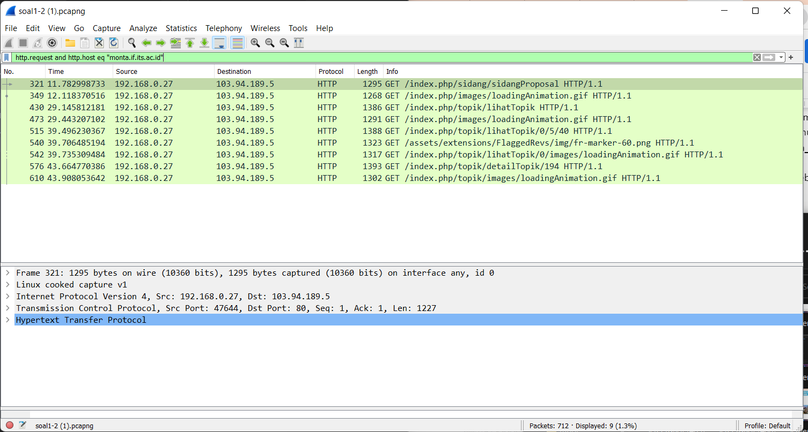

- klik kanan, lalu tekan `follow tcp stream`

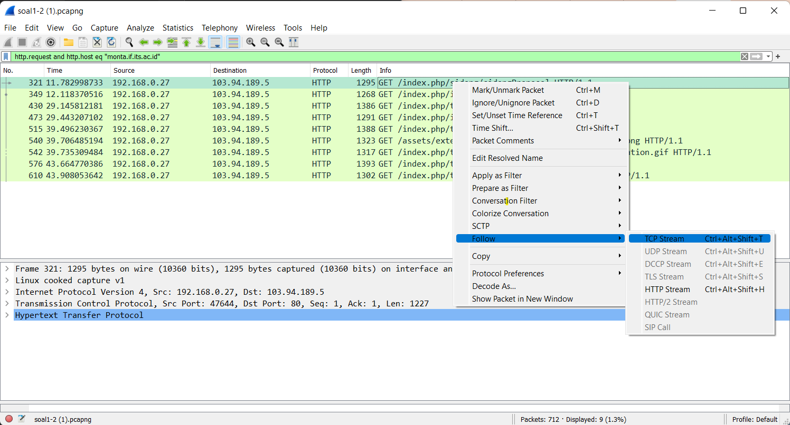

- terlihat bahwa server pada web menggunakan `Nginx`

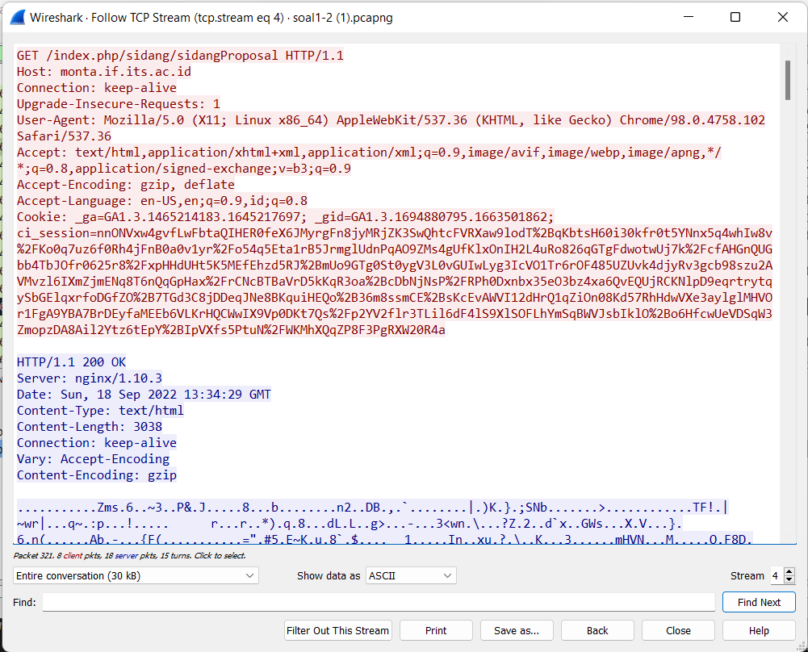

## 2. Ishaq sedang bingung mencari topik ta untuk semester ini , lalu ia datang ke website monta dan menemukan detail topik pada website “monta.if.its.ac.id” , judul TA apa yang dibuka oleh ishaq ?

- display filter: `ip.host == 103.94.189.5 && http contains "detailTopik"`

- setelah itu terlihat bahwa client mengunjungi link index.php/topik/detailTopik/194. Lalu diketikkan ke mesin pencari.

hasil yang didapat adalah sebagai berikut

- Link: http://monta.if.its.ac.id/index.php/topik/detailTopik/194

- Judul: `Evaluasi unjuk kerja User Space Filesystem (FUSE)`

## 3. Filter sehingga wireshark hanya menampilkan paket yang menuju port 80! 

- display filter: `tcp.dstport == 80 || udp.dstport == 80`

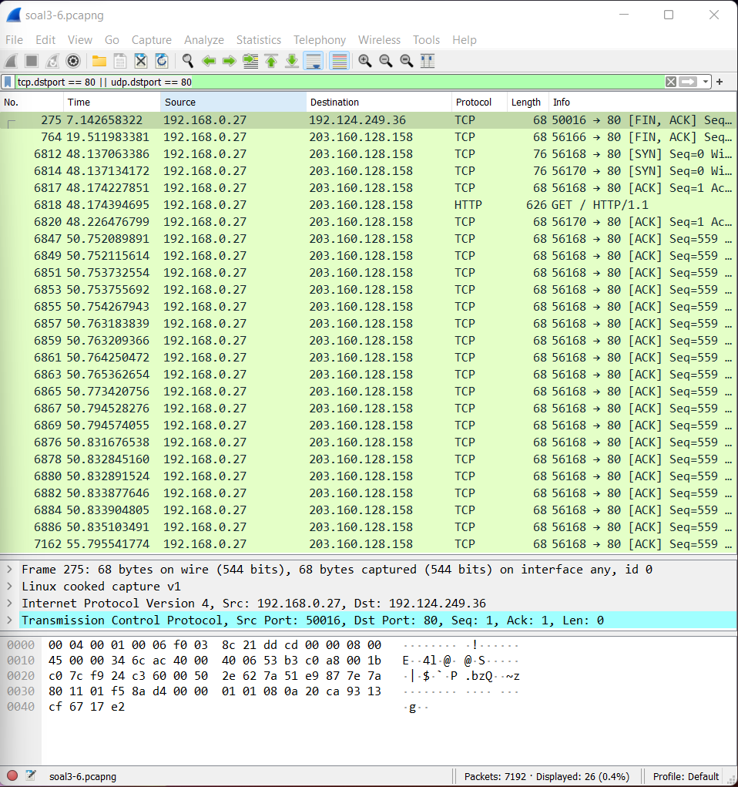

## 4. Filter sehingga wireshark hanya mengambil paket yang berasal dari port 21!

- display filter: `tcp.srcport == 21 || udp.srcport == 21`

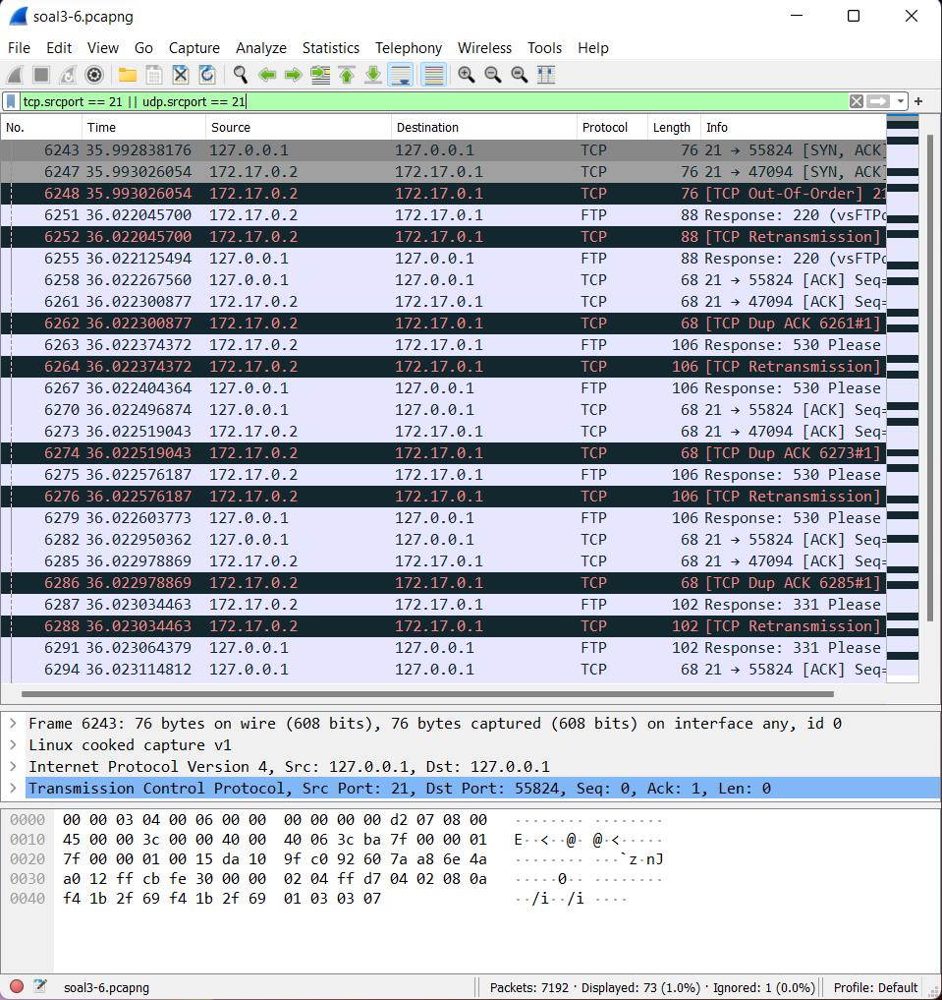

## 5. Filter sehingga wireshark hanya mengambil paket yang berasal dari port 443!

- display filter: `tcp.srcport == 443 || udp.srcport == 443`

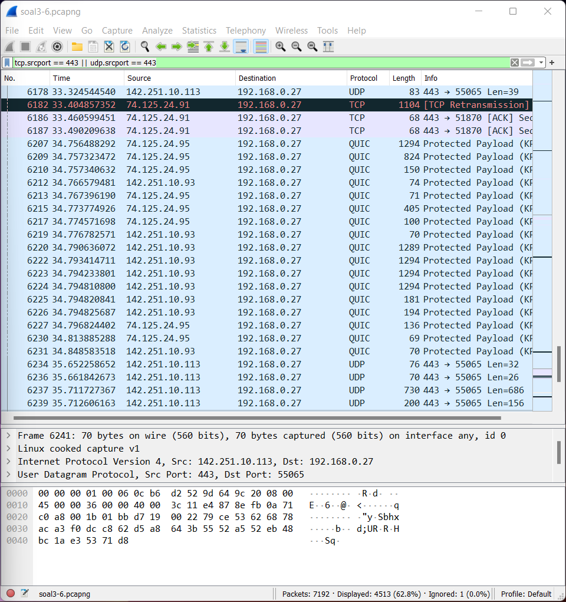

## 6. Filter sehingga wireshark hanya menampilkan paket yang menuju ke lipi.go.id !

- display filter: `http contains "lipi.go.id"`

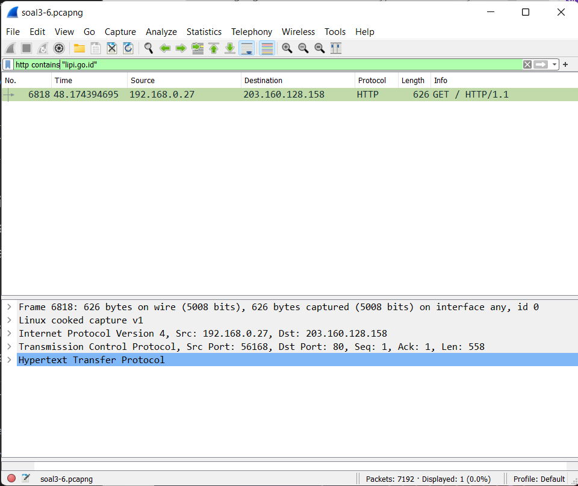

## 7. Filter sehingga wireshark hanya mengambil paket yang berasal dari ip kalian!

- display filter: ` ip.src_host == 192.168.255.24`

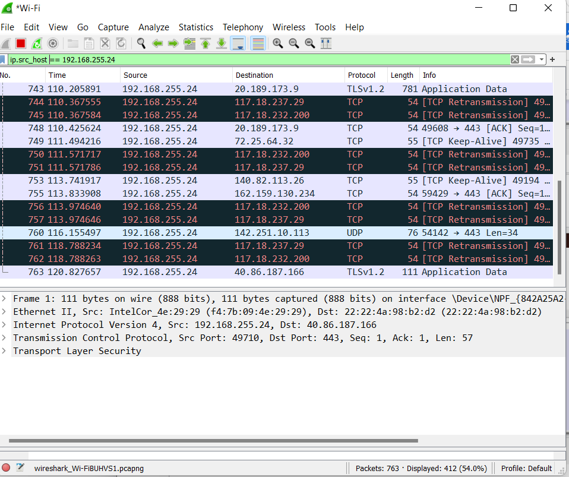
## 8. Telusuri aliran paket dalam file .pcap yang diberikan, cari informasi berguna berupa percakapan antara dua mahasiswa terkait tindakan kecurangan pada kegiatan praktikum. Percakapan tersebut dilaporkan menggunakan protokol jaringan dengan tingkat keandalan yang tinggi dalam pertukaran datanya sehingga kalian perlu menerapkan filter dengan protokol yang tersebut.

- display filter: ` tcp.flags.push == 1`
Protokol jaringan yang memiliki tingkat keandalah pertukaran data yang tinggi adalah protokol TCP. Namun jika dilihat, hasil filter dari display filter ` tcp` saja akan mengeluarkan banyak paket. Oleh karena itu kita dapat menggunakan ` tcp.flags.push == 1` untuk filter packet yang mempunyai flag PSH, yang berarti paket langsung dikirimkan ke application layer.

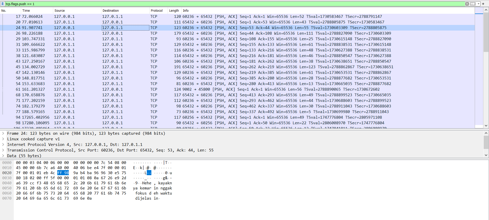

## 9. Terdapat laporan adanya pertukaran file yang dilakukan oleh kedua mahasiswa dalam percakapan yang diperoleh, carilah file yang dimaksud! Untuk memudahkan laporan kepada atasan, beri nama file yang ditemukan dengan format [nama_kelompok].des3 dan simpan output file dengan nama “flag.txt”.

- dari salah satu message yang ada, kita dapat melihat bahwa file dikirim pada port 9002 dan tersimpan sebagai file salt.

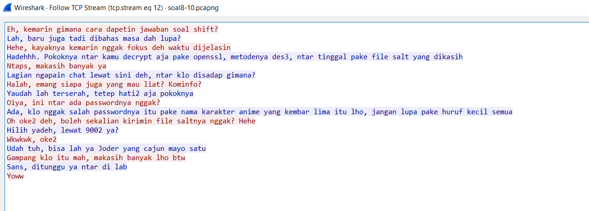

- setelah menggunakan filter ` tcp.port == 9002 and ip.src == 127.0.1.1 and ip.dst == 127.0.0.1` kita akan mendapatkan file salt.

- lalu kita dapat save file as raw.

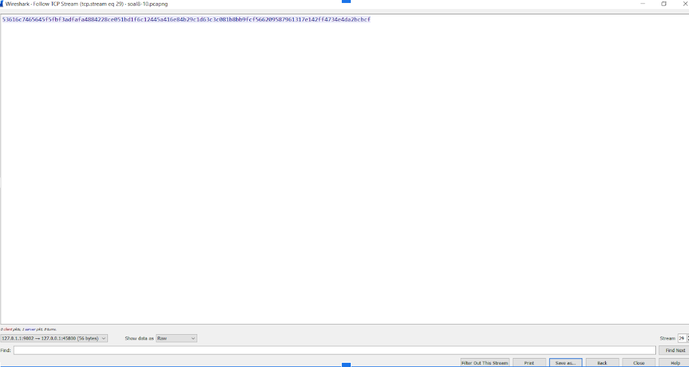

- isi file raw:

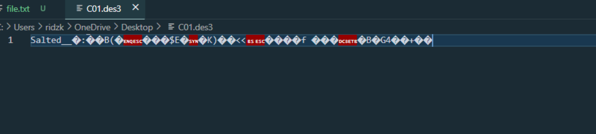

- lalu kita dapat menggunakan openssl untuk decrypt isi file menggunakan password yang didapatkan dari sejarah pesan antar kedua pihak.

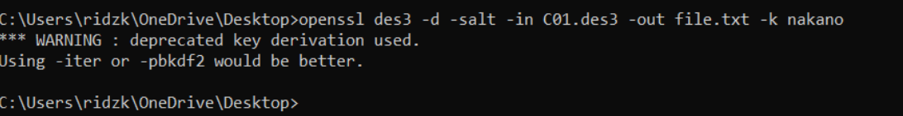

- hasil file output:

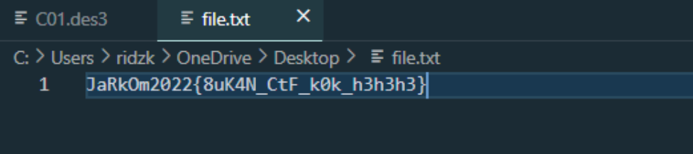

## 10. Temukan password rahasia (flag) dari organisasi bawah tanah yang disebutkan di atas!

- dari hasil no. 9, didapatkan flag `8uK4N_CtF_k0k_h3h3h3`

## Kesulitan

- susah mencari keyword dari beberapa case di search engine
